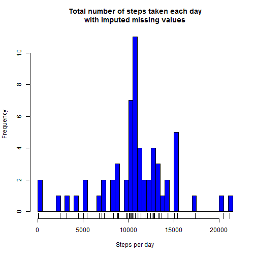

Overview
This assignment makes use of data from a personal activity monitoring device. This device collects data at 5 minute intervals through out the day. The data consists of two months of data from an anonymous individual collected during the months of October and November, 2012 and include the number of steps taken in 5 minute intervals each day.

The purpose is to analyse and display the data in graphs and outputs. 
This markdown file and it's content is sectioned as the assignment.

*************

### Loading and preprocessing the data


```r
# Load the data
steps <- read.csv(unz("activity.zip","activity.csv"))

# Process/transform the data into a format suitable for analysis
steps$date <- as.Date(as.character(steps$date))
```

************

### What is mean total number of steps taken per day?

_Ignoring the missing values in the dataset_


```r
# Calculate the total number of steps taken per day
daySteps <- aggregate(steps ~ date, data = steps, FUN=sum)
```


Creationg a Histogram of the total number of steps taken each day:


```r
hist(daySteps$steps, breaks = length(daySteps$date), angle = 45, col = "blue",
     xlab = "Steps per day",
     main = "Total number of steps taken each day")
rug(daySteps$steps)
```


Calculate the mean and median of the total number of steps taken per day:


```r
summary(daySteps$steps)[3:4]
```

```
## Median   Mean 
##  10760  10770
```

*************

### What is the average daily activity pattern?

Time series plot containing the 5-minute interval (x-axis) and the average number of steps taken, averaged across all days (y-axis) in the current plot below:


```r
intervalSteps <- aggregate(steps ~ interval, data = steps, FUN=mean, na.rm=TRUE)

with( intervalSteps, plot(x = interval, y = steps, type ="l", col = "blue",
                          main = "Average Daily Activity Pattern",
                          xlab = "Interval",
                          ylab = "Number of steps taken"))
```


Which 5-minute interval, on average across all the days in the dataset, contains the maximum number of steps?

Displaying the interval number (836), and the maximum average number of steps that it has (206)


```r
intervalSteps[which.max( intervalSteps$steps ),]
```

```
##     interval    steps
## 104      835 206.1698
```

*******************

### Imputing missing values

Total number of missing values in the dataset:


```r
summary(steps$steps)[7]
```

```
## NA's 
## 2304
```


I will here create a new dataset (imputedSteps) that is equal to the original dataset but with the missing data filled in. Ttrategy for filling in all of the missing values in the dataset based on the mean steps for the 5-minute interval where there are missing values (NA's)


```r
imputedSteps <- steps
imputedSteps[which(is.na(imputedSteps$steps)), "steps"] <- rep(mean(imputedSteps$steps, na.rm=TRUE), times=length(which(is.na(imputedSteps$steps))))
```

Histogram of the total number of steps taken each day:


```r
# Calculate the total number of steps taken per day
daySteps2 <- aggregate(steps ~ date, data = imputedSteps, FUN=sum)
# plot the imputed steps
hist(daySteps2$steps, breaks = length(daySteps2$date), angle = 45, col = "blue",
     xlab = "Steps per day",
     main = "Total number of steps taken each day\nwith imputed missing values")
rug(daySteps2$steps)
```



The mean and median total number of steps taken per day:


```r
summary(daySteps2$steps)[3:4]
```

```
## Median   Mean 
##  10770  10770
```

The median has shifted a small bit compared to the median of the steps containing missing values, but the mean value remains the same as before the imputed values. 

The impact of imputing missing data on the estimates of the total daily number of steps is increasing the frequency peak on the plot a little, but the mean values are not affected. The median is also shifted a bit upwards. The impact is not affecting the measurement significantly.

******************

### Are there differences in activity patterns between weekdays and weekends?

I create a new factor variable in the dataset with two levels – “weekday” and “weekend” indicating whether a given date is a weekday or weekend day.


```r
# Create a new variable:
imputedSteps$daytype <- NULL
# Loop troug dataset
for(i in 1:nrow(imputedSteps)){
      # Check if weekday is 6 or 7 (Weekend)
      if(format(imputedSteps[i,2], "%u") %in% c("6","7")){
            imputedSteps[i,"daytype"] <- "weekend" 
      } else {
            imputedSteps[i,"daytype"] <- "weekday" 
      }
}
# make daytype as a factor insted as a character: 
imputedSteps$daytype <- as.factor(imputedSteps$daytype)
```


Panel plot containing the interval (x-axis) and the average number of steps taken, averaged across all weekday days or weekend days (y-axis). 


```r
# aggregate mean steps  by daytype and interval
daytypeStepsInterval <- aggregate(imputedSteps$steps, 
                                  by = list(interval = imputedSteps$interval,                                                                daytype =imputedSteps$daytype),
                                  FUN=mean)

library(ggplot2)

ggplot(daytypeStepsInterval, aes(x=interval, y=x)) + 
        geom_line(color="blue") + 
        facet_wrap(~ daytype, nrow=2, ncol=1) +
        labs(x="5 min. Interval", y="Number of steps")  + theme_bw()
```


